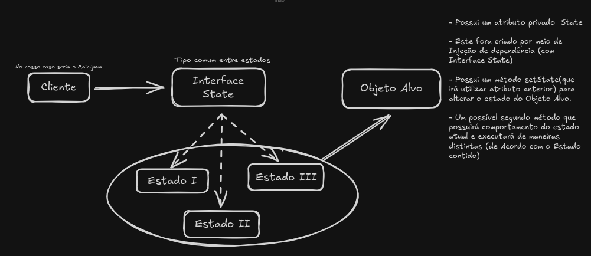

# Padrão _State_
`@FlavioNascimento99`

#### Introdução
O Padrão State tem como objetivo, trazer a possibilidade de alterar estados de Objetos dentro do teu código, quando falamos em estados, estamos falando de atributos ou métodos do Objeto alvo. O State em si, se trata de uma interface que amarra os possíveis estados existentes dentro do contexto da aplicação e a sua implementação ocorre por meio de injeção de dependência, evitando um possível forte acoplamento de código.

#### Visualizer de Interação

#### Ideia do código
Trata-se de uma aplicação simulada de controle de energia, onde temos uma Interface injetada(via DI) dentro da Classe alvo "Luz" capaz, através do método `setState()` de alterar a propriedade que diz se a mesma está ou não em fucionamento.
#### Camadas do código
1. `Interface State` com método assinado `execute()` 
2. Duas Classes onde a `Interface` é implementada com seu método assinado, `TurnOn` e `TurnOff`.
3. Classe alvo, `Luz` que possui uma injeção de um Objeto nulo do tipo `State` que será responsável por trazer diferentes resultados quando chamado o método `execute()`.

#### Explicação de Interface State e versões de States
Entenda que a Interface State é o que faz semelhança entre os possíveis estados que a Classe Alvo poderá possuir, isso ocorre por conta da Injeção de dependência, novamente trabalhando o fraco acoplamento de código, ele será responsável por trazer diferentes lógicas para dentro da Classe.

O método `execute()` é presente dentro da classe luz é apenas uma camada responsável por trazer o método assinado na Interface `action()`, então execute não possui uma lógica complexa mas sim o papel de trazer o método assinado pelas diferentes Classes que implementam a `Interface State`.